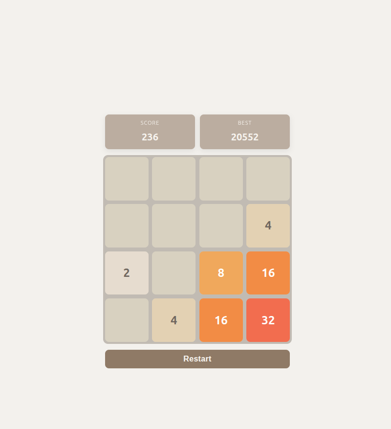
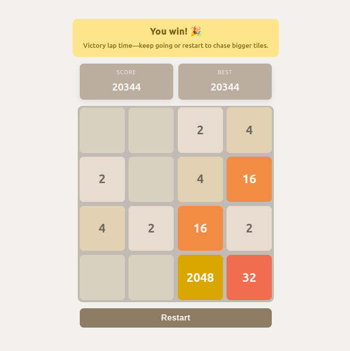
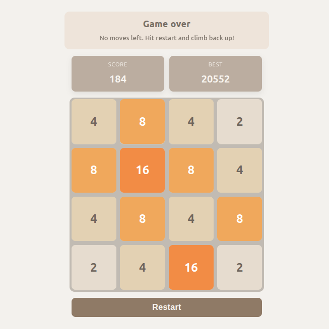

# 2048 Game (TypeScript, Vite) 🎮🧩

Built for fun: a classic 2048 puzzle that runs in the browser with a vanilla TypeScript codebase and Vite tooling.

## Tech stack

- 🟦 TypeScript for game logic and DOM updates
- ⚡ Vite for dev server and builds
- 🎨 Plain CSS for layout and tile styling

## Getting started

- Install deps: `npm install`
- Run dev server: `npm run dev`
- Build for production: `npm run build`
- Preview the production build: `npm run preview`

## Screenshots

## Tasks to implement

- [ ] Set responsive CSS to match the user system theme
- [ ] Set tests
